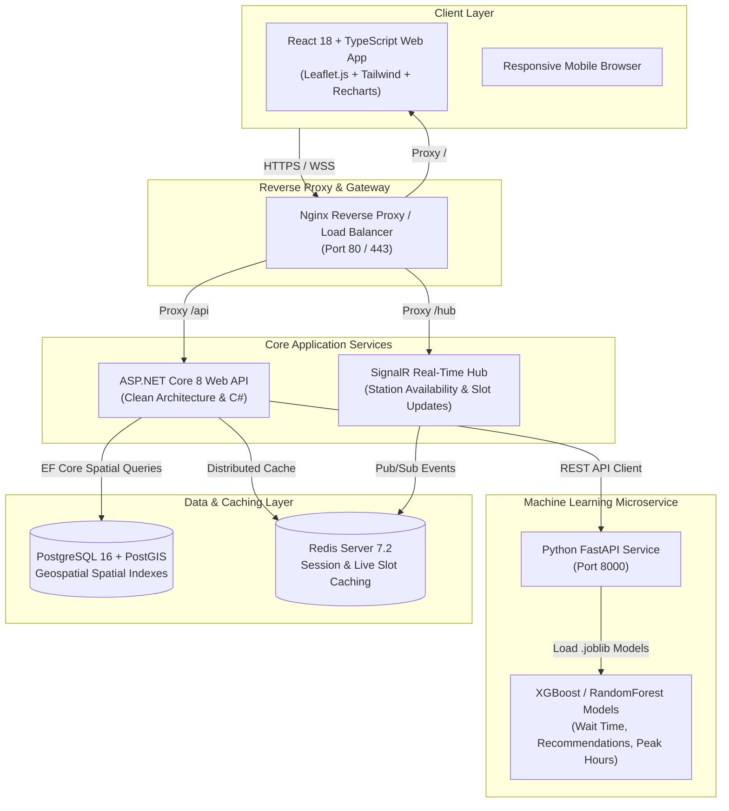
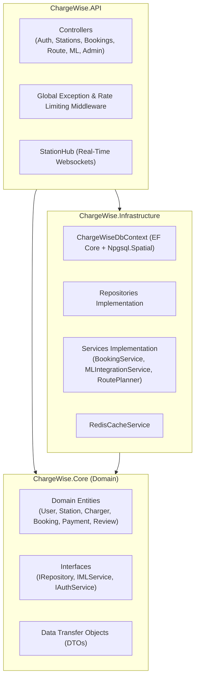

# ChargeWise AI - System Architecture Specification

## 1. High-Level System Architecture Diagram

---

## 2. Low-Level Component Architecture (Clean Architecture)

---

## 3. Data Flow Overview

1. **Station Location & Geospatial Search**: User sends current coordinates `(lat, lng, radius)`. `StationsController` invokes `IStationRepository` which uses PostGIS `ST_DWithin` spatial query.
2. **Machine Learning Predictions**: `StationsController` requests ML forecasts from `MLIntegrationService`. ASP.NET Core dispatches HTTP POST to Python FastAPI `/predict/waiting-time` and `/recommend/stations`.
3. **Double Booking Prevention**: `BookingService` executes atomic slot availability checks using Redis distributed locks and database transaction isolation levels.
4. **Real-time Availability Push**: Upon slot confirmation or cancellation, `StationHub` broadcasts updated charger availability to all connected Leaflet map clients.
