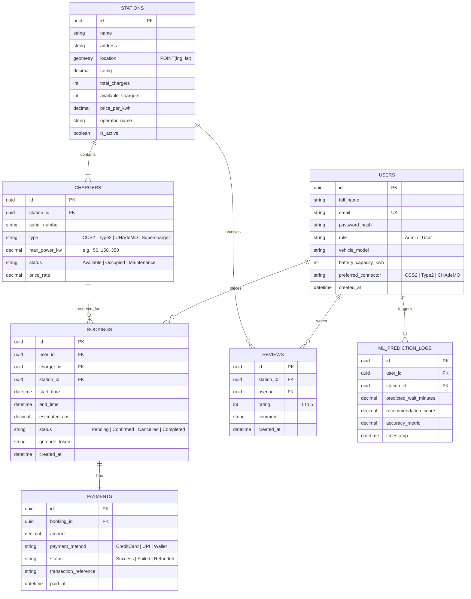

# ChargeWise AI - Entity Relationship Diagram (ERD) & Schema Specification

```mermaid
erDiagram
    USERS ||--o{ BOOKINGS : "places"
    USERS ||--o{ REVIEWS : "writes"
    STATIONS ||--|{ CHARGERS : "contains"
    STATIONS ||--o{ REVIEWS : "receives"
    CHARGERS ||--o{ BOOKINGS : "reserved_for"
    BOOKINGS ||--|| PAYMENTS : "has"
    USERS ||--o{ ML_PREDICTION_LOGS : "triggers"

    USERS {
        uuid id PK
        string full_name
        string email UK
        string password_hash
        string role "Admin | User"
        string vehicle_model
        int battery_capacity_kwh
        string preferred_connector "CCS2 | Type2 | CHAdeMO"
        datetime created_at
    }

    STATIONS {
        uuid id PK
        string name
        string address
        geometry location "POINT(lng, lat)"
        decimal rating
        int total_chargers
        int available_chargers
        decimal price_per_kwh
        string operator_name
        boolean is_active
    }

    CHARGERS {
        uuid id PK
        uuid station_id FK
        string serial_number
        string type "CCS2 | Type2 | CHAdeMO | Supercharger"
        decimal max_power_kw "e.g., 50, 150, 350"
        string status "Available | Occupied | Maintenance"
        decimal price_rate
    }

    BOOKINGS {
        uuid id PK
        uuid user_id FK
        uuid charger_id FK
        uuid station_id FK
        datetime start_time
        datetime end_time
        decimal estimated_cost
        string status "Pending | Confirmed | Cancelled | Completed"
        string qr_code_token
        datetime created_at
    }

    PAYMENTS {
        uuid id PK
        uuid booking_id FK
        decimal amount
        string payment_method "CreditCard | UPI | Wallet"
        string status "Success | Failed | Refunded"
        string transaction_reference
        datetime paid_at
    }

    REVIEWS {
        uuid id PK
        uuid station_id FK
        uuid user_id FK
        int rating "1 to 5"
        string comment
        datetime created_at
    }

    ML_PREDICTION_LOGS {
        uuid id PK
        uuid user_id FK
        uuid station_id FK
        decimal predicted_wait_minutes
        decimal recommendation_score
        decimal accuracy_metric
        datetime timestamp
    }
```
